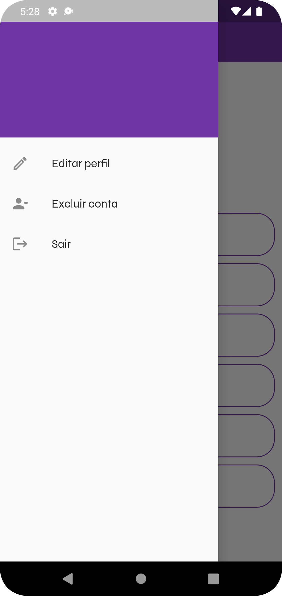

# 👤 CRUD Flutter

O CRUD Flutter é um aplicativo simples de gerenciamento de perfil de usuário, desenvolvido utilizando Flutter, Firebase, MobX e Modular. Este aplicativo oferece funcionalidades básicas de CRUD (Create, Read, Update, Delete) para armazenar e gerenciar informações de perfil de usuário.


# 🚀 Tecnologias Utilizadas
- **Flutter**: Framework de desenvolvimento de aplicativos multiplataforma.
- **Dart**: Linguagem de programação utilizada no desenvolvimento de aplicativos Flutter.
- **Modular**: Biblioteca para organização e injeção de dependências no Flutter.
- **MobX**: Biblioteca de gerenciamento de estado reativo para aplicativos Flutter.
- **Firebase**: Plataforma de desenvolvimento de aplicativos móveis do Google, utilizada para autenticação de usuários (Firebase Auth) e armazenamento de dados (Firebase Storage).

# 📌 Recursos
O CRUD Flutter oferece as seguintes funcionalidades:

- Login com E-mail e Senha: Os usuários podem autenticar-se no aplicativo utilizando seu endereço de e-mail e senha cadastrados.
- Cadastro de Usuário: Os usuários podem criar um novo perfil fornecendo informações como foto de perfil, nome, e-mail, CPF, telefone, estado civil, gênero e senha.
- Visualizar Perfil: Os usuários podem visualizar todas as informações do seu perfil armazenadas no aplicativo.
- Atualizar Dados: Os usuários podem atualizar as informações do seu perfil, incluindo foto, nome, e-mail e telefone.
- Excluir Usuário: Os usuários têm a opção de excluir permanentemente o seu perfil do aplicativo.

# Demonstração

<p>


</p>

<p>



</p>

# ℹ️ Como Utilizar

Para utilizar o CRUD Flutter, siga estas etapas:

```bash
Clone the Repository: git clone https://github.com/waneymartinsM/crud_flutter.git
Navigate to the Project Directory: cd crud_flutter
Install Dependencies: flutter pub get
Run the Project: flutter run
```

## 🤝 Contribuições
Contribuições são sempre bem-vindas! Se você deseja contribuir para este projeto, siga estas etapas:

Faça um fork do projeto.
Crie uma nova branch com a sua feature: git checkout -b feature/nova-feature
Realize as alterações necessárias e faça commit das mudanças: git commit -m 'Adicione uma nova feature'
Faça push para a branch: git push origin feature/nova-feature
Abra um pull request para revisão.